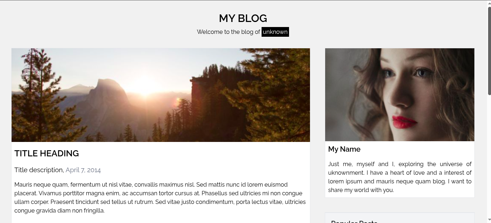
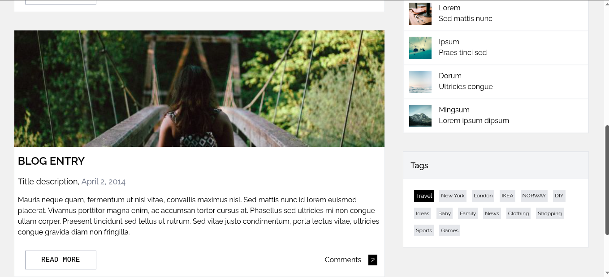

# My Blog

Este projeto é uma página moderna, rápida e responsiva, ideal para compartilhar ideias e conteúdos diversos. Ele conta com um template de blog minimalista, perfeito para quem valoriza simplicidade com elegância.

## Tecnologias

-   Tailwind CSS;
-   React
-   TypeScript;
-   Docker;

## Demonstração

Você pode acessar a página <a href="https://my-blog-rho-navy-76.vercel.app/">aqui</a>.

## Imagens

## Credítos

O **design** da página foi inspirado por <a href="https://www.w3schools.com/w3css/w3css_templates.asp">W3Schools</a>.
